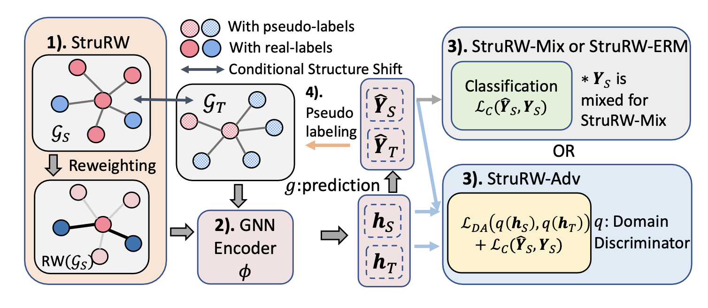

<h1 align="center">Structural Re-weighting Improves Graph Domain Adaptation (StruRW)</h1>

This repository is the implementation for the paper [Structural Re-weighting Improves Graph Domain Adaptation](https://arxiv.org/abs/2306.03221) by Shikun Liu, Tianchun Li, Yongbin Feng, Nhan Tran, Han Zhao, Qiu Qiang, and Pan Li.

## Overview ##
This work examines different impacts of distribution shifts in graph domain adaptation (GDA) caused by either graph structure or node attributes. We identifies a new type of shift, named conditional structure shift (CSS), which current GDA approaches are provably suboptimal to deal with. The structural reweighting (StruRW) module is proposed to address this issue and it can be compatible with ERM GNN training, OOD-based model like Mixup and the adversarial-based DA techniques. 

The basic intuition for StruRW is to upweight/downweight the edges in the source graphs to match the graph structure in the target graphs. The graph strucutre is defined based on the edge connection probability matrix following the CSBM assumption. Then, the edge reweighting step is done before the GNN encoding process and the training are based on the reweighted source graphs. The pipeline is demonstrated as in Fig. 1 and more details are explained in our paper.  
<p align="center"></p>
<p><em>Figure 1.</em> The model pipeline combined with StruRW module, GNN encoder and the generalized loss calculation block that supports StruRW-Adv, StruRW-Mix, and StruRW-ERM. </p>

## Environment ##
The code depends on `Python 3.9` with `PyTorch 1.12.1`, `PyG 2.2.0` and `CUDA 11.3`. Please follow the following steps to create a virtual environment and install the required packages.

Step 1: Create a virtual environment
```
conda create --name StruRW python=3.9 -y
conda activate StruRW
```
Step 2: Install dependencies
```
conda install -y pytorch==1.12.1 torchvision cudatoolkit=11.3 -c pytorch
pip install torch-scatter==2.1.0 torch-sparse==0.6.16 torch-cluster==1.6.0 torch-geometric==2.2.0 -f https://data.pyg.org/whl/torch-1.12.0+cu113.html
pip install -r requirements.txt
```

## Datasets ##
- Fast simulation datasets are the High Energy Physics (HEP) dataset from the pileup mitigation task. You can download the dataset root files here: https://zenodo.org/record/8015774
- The DBLP and ACM datasets can be downloaded following the [UDAGCN](https://github.com/GRAND-Lab/UDAGCN) Github repo. 
- The Cora and Arxiv data can be downloaded following the [GOOD](https://github.com/divelab/GOOD) Github repo. 

Below are some statistics on the real citation and HEP datasets:
| Dataset | # Classes | # Nodes | # Edges | # Dim of node feature |
| :---  | :---:  | :---: |  :---: | :---: |
| ACM | 6 | 7410  | 22270   | 7537| 
| DBLP| 6 | 5578  | 14682 | 7537  | 
| Cora| 70 | 19793  | 126842   | 8710  | 
| Arxiv| 40 |169343  | 2315598  | 128 | 

| Dataset | PU10_gg | PU30_gg | PU50_gg | PU50_Z($\nu\nu$) | PU140_gg | PU140_Z($\nu\nu$)|
| :---  | :---:  | :---: |  :---: | :---: |:---: | :---: |
| Avg # Nodes | 185.17 | 417.84  | 619.00   | 570.90| 1569.04 | 1602.14
| Avg # Edges | 1085.17 | 3518.43  | 7169.51 | 5894.80  | 42321.71 | 44070.80
| LC/OC ratio| 2.8600 | 0.2796  | 0.1650   | 0.0927  | 0.0575 | 0.0347


## Training ##
For the training of each StruRW-based model, go to the corresponding folder
'StruRW_ADV' stands for adversarial training based model, 'StruRW_ERM' stands for the ERM based model and 'StruRW_Mix' stands for the mixup-based model
```
python run_nni.py -d [dataset] -m [method] -b [backbone] --dir_name [dir_name]
```

`dataset` can be choosen from `SBM`, `dblp_acm`, `cora`, `arxiv`, `Pileup`\
`method` can be chosen from `ERM` and `ERM_rw`; `DANN` and `DANN_rw`; `Mixup` and `Mixup_rw` for each StruRW-based model and their corresponding baseline. \
`backbone` can be `GCN` or `GS`\
`dir_name` is the name you want to name your directory, which will saves the log file of the experiment.

Other arguments can be passed with specific to models, check the argument list for detailed description

Specific arguments for running different datasets:
CSBM: `num_nodes`, `sigma`, `ps`, `qs`, `pt`, `qt`\
dblp_acm: `src_name`, `tgt_name`, specify the name from 'dblp' and 'acm'\
cora: `domain_split` can be chosen from 'word' or 'degree'\
arxiv: `domain_split` can be specified as 'degree' if want to run the shift with node degree; otherwise, use `start_year` and `end_year` to specify the time period for training.\
Pileup: `num_events`, `balanced`, `train_sig`, `train_PU`, `test_sig`, `test_PU`\

Specific arguments for model:
DANN and StruRW-adv: `alphatimes`, `alphamin`\
For all StruRW-based model: specify `rw_lmda`, `start_epoch`, `rw_freq`

The choice of hyperparameter and their search space has been specified in the appendix of our paper

## Citation ##
If you find our paper and repo useful, please cite our paper:
```bibtex
@article{liu2023structual,
  title       = {Structural Re-weighting Improves Graph Domain Adaptation},
  author      = {Liu, Shikun and Li, Tianchun and Feng, Yongbin and Tran, Nhan and Zhao, Han and Qiang, Qiu and Li, Pan},
  journal     = {International Conference on Machine Learning},
  year        = {2023}
}
```


